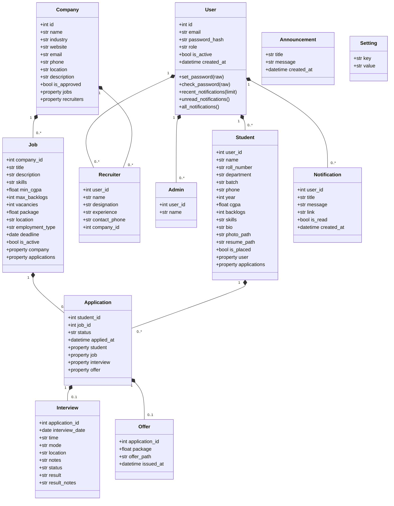

# Class Diagram

The application follows a **Model–View–Controller (MVC)** architecture. The diagrams below describe the design at the code level and at the database level.

---

## 1. Overview

```
Browser (HTML/CSS/JS + Bootstrap 5)
        |
        v
Flask Router (Blueprints: main, auth, student, recruiter, admin)
        |
        v
Controllers (route functions) <--> Services / Helpers (utils/)
        |
        v
Models (SQLAlchemy ORM) <--> SQLite database
```

- **Models** — `models.py` defines 11 ORM classes.
- **Views** — Jinja2 templates in `templates/`, organised by role.
- **Controllers** — route functions in `blueprints/`, organised by role.
- **Helpers** — `utils/` (validators, decorators, files, notifications, queries, demo_data).

---

## 2. Model Classes (Code Level)



---

## 3. Route / Controller Map

| Blueprint  | URL prefix     | Key routes |
|------------|----------------|------------|
| `main`     | `/`            | index, about, announcements, notifications (view/mark-read), uploaded_file |
| `auth`     | `/auth`        | login, logout, student register, quick recruiter signup, forgot/reset/change password |
| `student`  | `/student`     | dashboard, profile, resume upload/delete, jobs, job_detail, apply, withdraw, applications, interviews (join), offers, download_offer |
| `recruiter`| `/recruiter`   | dashboard, company update, jobs CRUD, applicants, applicant_detail, schedule_interview, select/reject, offers (upload/download) |
| `admin`    | `/admin`       | dashboard, students/recruiters/companies/jobs/applications/interviews management, approvals, announcements, reports, settings, CSV exports |

All role-gated routes are protected by decorators (`login_required`, `student_required`, `recruiter_required`, `admin_required`) from `utils/decorators.py`.

---

## 4. Design Patterns Used

- **Factory pattern** — `create_app()` builds and configures the Flask app.
- **MVC separation** — models, blueprints (controllers), templates (views) are strictly separated.
- **Repository-style helpers** — `utils/queries.py` centralises statistics and eligibility logic so controllers stay thin.
- **Notification service** — `utils/notifications.py` is a single entry point for creating in-app notifications.
