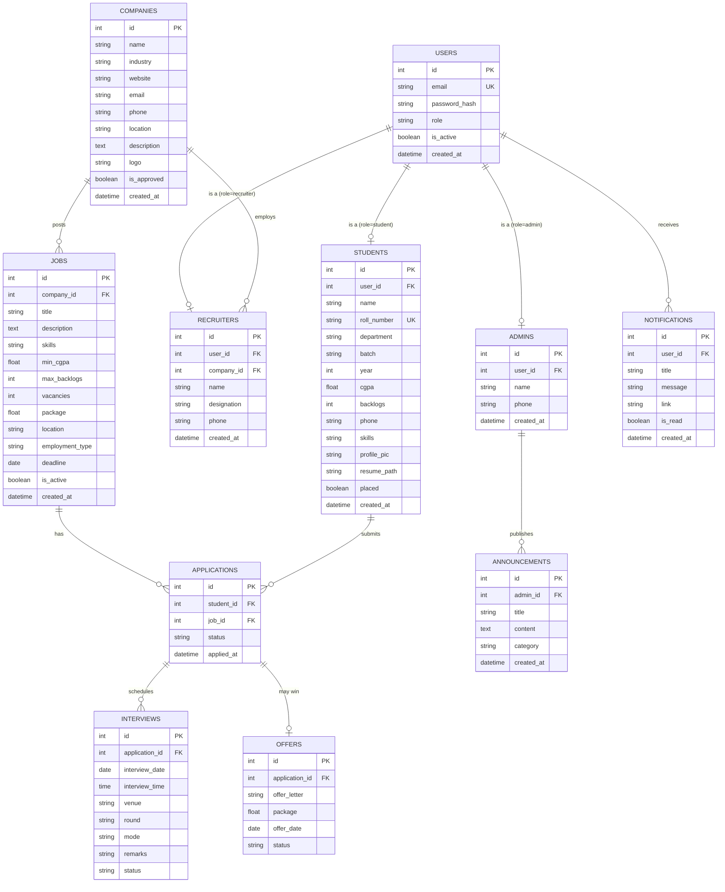

# Database Design & ER Diagram

## 1. Overview

The database uses **SQLite** with **SQLAlchemy ORM**. It is created automatically on first run with `db.create_all()`. Eleven tables are defined; all primary keys are auto-increment integers and all relationships use foreign keys with `cascade="all, delete-orphan"` where ownership applies.

## 2. Table Summary

| # | Table         | Purpose                                             |
|---|---------------|-----------------------------------------------------|
| 1 | users         | Single sign-on table; role determines access        |
| 2 | students      | Academic + personal details for student accounts    |
| 3 | recruiters    | Links a recruiter account to a company              |
| 4 | admins        | Placement officer details                           |
| 5 | companies     | Company profiles; status controlled by admin          |
| 6 | jobs          | Job postings with eligibility criteria              |
| 7 | applications  | Student ⇄ job applications with status tracking     |
| 8 | interviews    | Interview rounds per application                    |
| 9 | offers        | Offer letters uploaded per selection                |
| 10| announcements | Placement drives, results, news                     |
| 11| notifications | Per-user in-app notifications                       |

## 3. Entity Relationship Diagram



## 4. Column Details & Constraints

### users
| Column        | Type     | Constraint                |
|---------------|----------|---------------------------|
| id            | Integer  | PK, auto-increment        |
| email         | String120| UNIQUE, NOT NULL, indexed |
| password_hash | String256| NOT NULL (Werkzeug hash)  |
| role          | String20 | NOT NULL (student/recruiter/admin) |
| is_active     | Boolean  | default True              |
| created_at    | DateTime | default now               |

### students
| Column      | Type     | Constraint                       |
|-------------|----------|----------------------------------|
| id          | Integer  | PK                               |
| user_id     | Integer  | FK→users.id, UNIQUE, NOT NULL    |
| name        | String120| NOT NULL                         |
| roll_number | String20 | UNIQUE, NOT NULL                 |
| department  | String100| NOT NULL                         |
| batch       | String10 | NOT NULL (e.g. 2022-2026)        |
| year        | Integer  | NOT NULL (1–4)                   |
| cgpa        | Float    | default 0.0                      |
| backlogs    | Integer  | default 0                        |
| phone       | String15 | validated                        |
| skills      | Text     | comma-separated                  |
| profile_pic | String256| path                             |
| resume_path | String256| path to PDF                      |
| placed      | Boolean  | default False                    |

### recruiters
| Column      | Type     | Constraint                    |
|-------------|----------|-------------------------------|
| id          | Integer  | PK                            |
| user_id     | Integer  | FK→users.id, UNIQUE, NOT NULL |
| company_id  | Integer  | FK→companies.id               |
| name        | String120| NOT NULL                      |
| designation | String100| NOT NULL                      |
| experience  | String20 | experience band from signup   |
| phone       | String15 | validated                     |

### admins
| Column   | Type     | Constraint                    |
|----------|----------|-------------------------------|
| id       | Integer  | PK                            |
| user_id  | Integer  | FK→users.id, UNIQUE, NOT NULL |
| name     | String120| NOT NULL                      |
| phone    | String15 |                               |

### companies
| Column      | Type     | Constraint                        |
|-------------|----------|-----------------------------------|
| id          | Integer  | PK                                |
| name        | String120| UNIQUE, NOT NULL                  |
| industry    | String100|                                   |
| website     | String120|                                   |
| email       | String120|                                   |
| phone       | String15 |                                   |
| location    | String100|                                   |
| description | Text     |                                   |
| logo        | String256|                                   |
| is_approved | Boolean  | default False; set True on recruiter signup or by the admin |

### jobs
| Column          | Type     | Constraint              |
|-----------------|----------|-------------------------|
| id              | Integer  | PK                      |
| company_id      | Integer  | FK→companies.id, NOT NULL |
| title           | String120| NOT NULL                |
| description     | Text     | NOT NULL                |
| skills          | Text     | required skills         |
| min_cgpa        | Float    | eligibility             |
| max_backlogs    | Integer  | eligibility             |
| vacancies       | Integer  | default 1               |
| package         | Float    | LPA                     |
| location        | String100|                         |
| employment_type | String20 | Full-time / Internship  |
| deadline        | Date     | application deadline    |
| is_active       | Boolean  | default True            |

### applications
| Column     | Type     | Constraint                                  |
|------------|----------|---------------------------------------------|
| id         | Integer  | PK                                          |
| student_id | Integer  | FK→students.id, NOT NULL                    |
| job_id     | Integer  | FK→jobs.id, NOT NULL                        |
| status     | String20 | default "applied"                           |
| applied_at | DateTime | default now                                 |
| UNIQUE(student_id, job_id) | — | prevents duplicate applications |

### interviews
| Column          | Type     | Constraint                     |
|-----------------|----------|--------------------------------|
| id              | Integer  | PK                             |
| application_id  | Integer  | FK→applications.id, NOT NULL   |
| interview_date  | Date     | NOT NULL                       |
| interview_time  | Time     |                                |
| venue           | String150|                                |
| round           | String50 | e.g. Aptitude, Technical, HR   |
| mode            | String20 | Online / Offline               |
| remarks         | String256|                                |
| status          | String20 | Scheduled / Done               |

### offers
| Column         | Type     | Constraint                     |
|----------------|----------|--------------------------------|
| id             | Integer  | PK                             |
| application_id | Integer  | FK→applications.id, NOT NULL   |
| offer_letter   | String256| PDF path                       |
| package        | Float    |                                |
| offer_date     | Date     |                                |
| status         | String20 | Pending / Accepted / Declined  |

### announcements
| Column     | Type     | Constraint                 |
|------------|----------|----------------------------|
| id         | Integer  | PK                         |
| admin_id   | Integer  | FK→admins.id, NOT NULL     |
| title      | String150| NOT NULL                   |
| content    | Text     | NOT NULL                   |
| category   | String30 | drive / result / interview / news |
| created_at | DateTime | default now                |

### notifications
| Column     | Type     | Constraint                  |
|------------|----------|-----------------------------|
| id         | Integer  | PK                          |
| user_id    | Integer  | FK→users.id, NOT NULL       |
| title      | String150| NOT NULL                    |
| message    | String300|                             |
| link       | String256| relative URL                |
| is_read    | Boolean  | default False               |
| created_at | DateTime | default now                 |

## 5. Relationships Summary

1. **User 1 ⟷ 0..1 Student** — each student account has exactly one academic profile.
2. **User 1 ⟷ 0..1 Recruiter** — each recruiter account maps to one recruiter profile.
3. **User 1 ⟷ 0..1 Admin** — each admin account maps to one admin profile.
4. **Company 1 ⟷ 1..N Recruiter** — a company can have multiple recruiters.
5. **Company 1 ⟷ 0..N Job** — a company posts many jobs.
6. **Job 1 ⟷ 0..N Application** — a job receives many applications.
7. **Student 1 ⟷ 0..N Application** — a student applies to many jobs.
8. **Application 1 ⟷ 0..N Interview** — an application can have multiple interview rounds.
9. **Application 1 ⟷ 0..1 Offer** — a selected application can receive one offer.
10. **Admin 1 ⟷ 0..N Announcement** — admins publish announcements.
11. **User 1 ⟷ 0..N Notification** — every user receives notifications.

## 6. Application Status Lifecycle

```
applied ─► shortlisted ─► interview scheduled ─► selected ─► offer sent
                │                                       │
                └────── rejected ◄───────────────────────┘
```

## 7. Indexes for Performance

- `users.email` (UNIQUE) — login lookups
- `students.roll_number` (UNIQUE)
- `applications.student_id`, `applications.job_id`
- `jobs.company_id`, `jobs.deadline`
- `notifications.user_id`
- `announcements.created_at`
