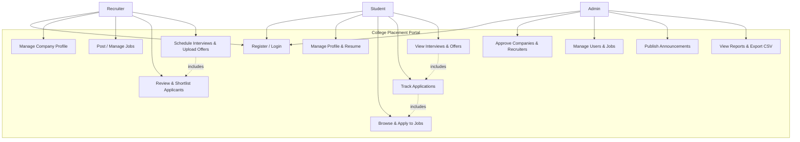
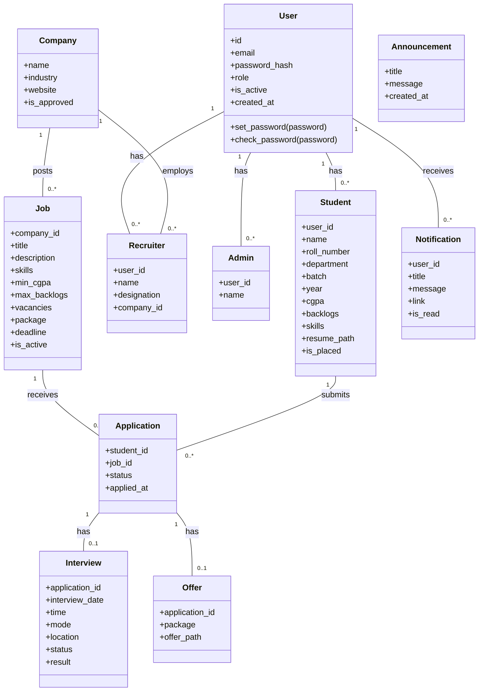
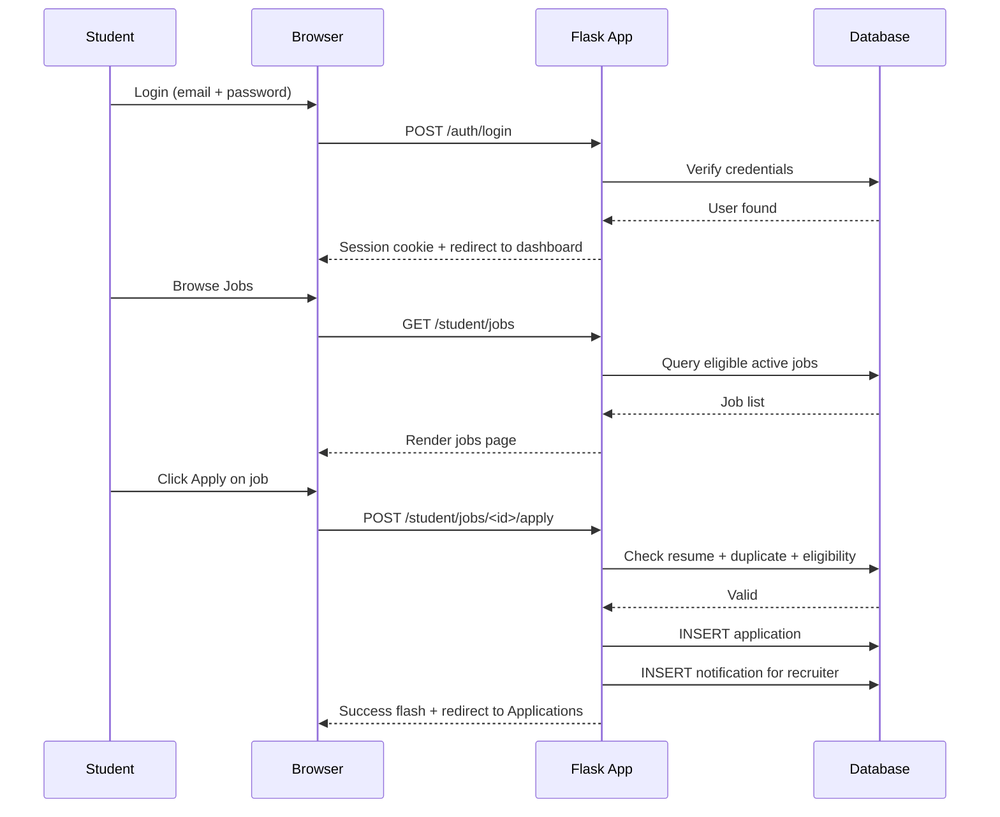
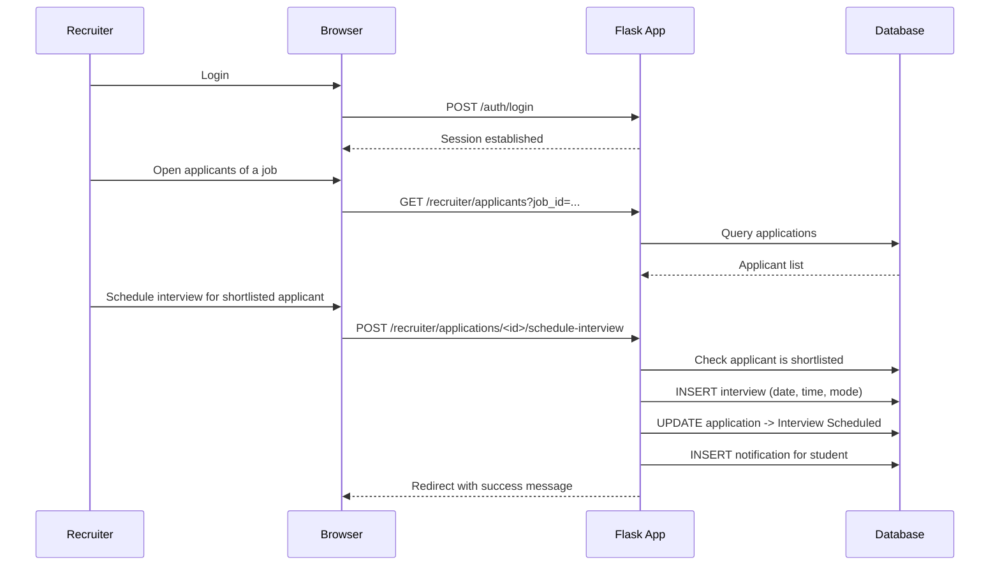
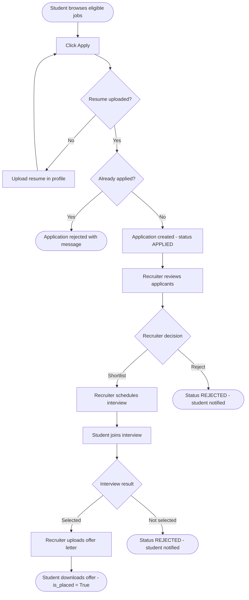
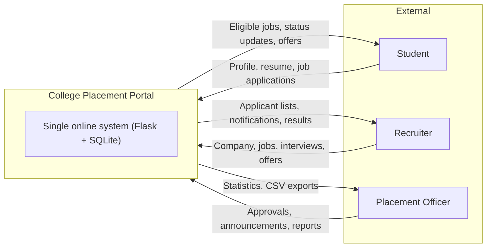
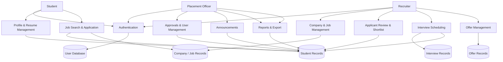

# UML & DFD Diagrams

The diagrams below use [Mermaid](https://mermaid.js.org/) syntax. Render them in any Mermaid-compatible editor (GitHub, VS Code with Mermaid plugin, or mermaid.live).

---

## 1. Use Case Diagram

---

## 2. Class Diagram (Core Entities)

---

## 3. Sequence Diagram — Student Applies to a Job

---

## 4. Sequence Diagram — Recruiter Schedules Interview

---

## 5. Activity Diagram — Application Lifecycle

---

## 6. Data Flow Diagram — Level 0 (Context)

---

## 7. Data Flow Diagram — Level 1

